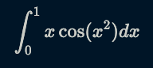

 ## Exercise: exploratory analysis

(a) Load the libraries that you will need by copying this code:

```python
import seaborn as sns
import matplotlib.pyplot as plt
from pathlib import Path
import matplotlib as mpl
Path("plots").mkdir(parents=True, exist_ok=True)
mpl.rcParams["figure.dpi"] = 150
sns.set_theme()
```

(b) Load the titanic dataset from `seaborn` with the `load_dataset` command. Print the columns and the summary statistics with the methods `describe` and `info`.

(c) Get the correlation matrix of the dataset and plot it into a heatmap with the `heatmap` command from `seaborn`. The code for the plot is similar to this but with your actual values of `df` and `filename`:

```python
colormap = plt.cm.Blues
f, ax = plt.subplots(figsize=(11,9))
heatmap = sns.heatmap(df.corr(), cmap=colormap, annot=True, linewidths=0.2)
f.savefig("plots/filename.png")
plt.clf()
```

(d) Count how many passengers survived and how many passengers were traveling on each class.

(e) Build a `catplot` that plots the survival rate according to passenger class and sex (there are several ways to do it, you just need to plot one that makes sense)

(a) Build a `violinplot` that represents the fare price by passenger class and survival status (there are several ways to do it, you just need to plot one that makes sense).

## Exercise: integrals

Calculate the following definite integral:



(1) Define the function.

(2) Declare the initial and final values of x, and the `dx`.

(3) Build a loop that calculates the integral as the accumulated sum of small slices of the area under the curve defined by `f(x)` and the `x` axis. You need to explicitly print the final value of the integral.


## Exercise: Exploratory analysis and regression

(1) Load the dataset stored in `assets/imports-85.csv`. The separator is a comma.

(2) Count how many cars are there per manufacturer.

(3) Plot a histogram with the distributions of `horspower`.

(4) Build a linear regression where `price` is the `y` variable and `horsepower` the `x` variable; print a summary of the results, and the intercept and the slope.

(5) Build a scatterplot where `horsepower` is the `x` variable and `price` the `y` variable.

(6) Build another linear regression with the regressors `horsepower`, `length`, and `width` in order to predict the `price`. Print the intercept and slope of `horsepower`. How is it different than before?

(7) Split the dataset into one for `diesel` cars and another one for `gas` cars. Draw a boxplot showing the price distribution of each fuel type.

(8) Build a logistic regression that predicts whether a car is `diesel` or `gas` based on the same regressors we used in (6). You will need to generate a binary variable named `gas`.

(9) Estimate the probabilities that a car is `gas` given its `price` is 24000, its `length` is 190, and its `horsepower` is 120.

## Exercise: Bayesian statistics 

(1) Suppose you have two coins in a box. One is a normal coin with heads on one side and tails on the other, and one is a trick coin with heads on both sides. You choose a coin at random and see that one of the sides is heads. What is the probability that you chose the trick coin?

(2) Elvis Presley had a twin brother (who died at birth). What is the probability that Elvis was an identical twin?

Data: in 1935, about 2/3 of twins were fraternal and 1/3 were identical.

Hint: note that if the brother had been a sister instead, it would not have been possible that they were identical twins.

(3) Load the `titanic` dataset. Estimate the probability that a person survived given it was traveling in first class and not alone. Now compare it with the probability of survival given traveling in first class but alone.